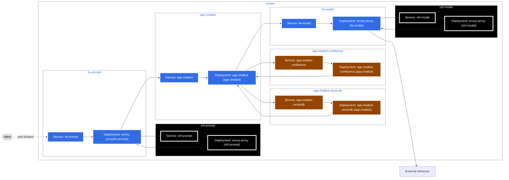

# AI Security Reference Architecture Demo

## Prerequisites

The following client tools are needed to run this demo:

- [Docker](https://www.docker.com/)
- [Kind](https://kind.sigs.k8s.io/)
- [kubectl](https://kubernetes.io/docs/reference/kubectl/)
- [Helm](https://helm.sh/)

An [OpenAI](https://platform.openai.com/) account and API Key are needed, with a Project with some credits.

## Architecture

The following diagram shows the demo architecture.



## Demo

In this demo, placeholder Envoy proxies and an echo server (which takes the place of a prompt firewall via Envoy [external authorization](https://www.envoyproxy.io/docs/envoy/latest/configuration/http/http_filters/ext_authz_filter)) have been introduced for the prompt firewall and model firewall, which log requests and responses. The role of the AI-enabled application is played by [aichat](https://github.com/sigoden/aichat), which forwards on requests to OpenAI via the model firewall.

Security contexts for the proxies and `aichat` have been hardened, and the `fw-prompt`, `app-chatbot` and `fw-model` namespaces have Pod Security Standards enforced at the Restricted level. Cilium is used as the CNI, and network policies have been set up so that inbound traffic to `aichat` must come from the `fw-prompt` namespace, and egress traffic must go to the `fw-model` namespace.

Set the `OPENAI_API_KEY` environment variable:

```bash
export OPENAI_API_KEY=<Paste Your API Key Here>
```

Spin up the infrastructure:

```bash
make all
```

Set up port forwarding to the prompt-firewall:

```bash
make port-forward
```

Send an example request:

```bash
make example-prompt
```

Run the example Bats test:

```bash
make test
```

## Teardown

```bash
make down
```
